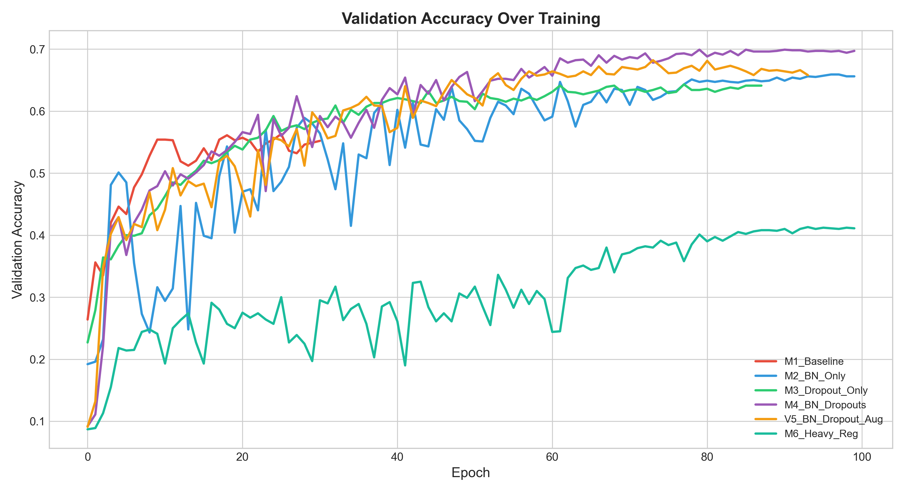
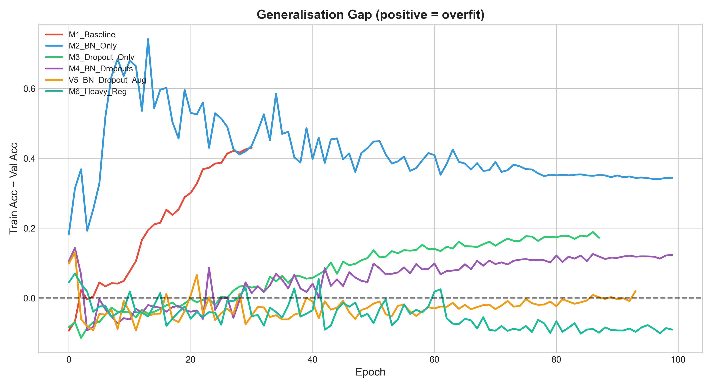
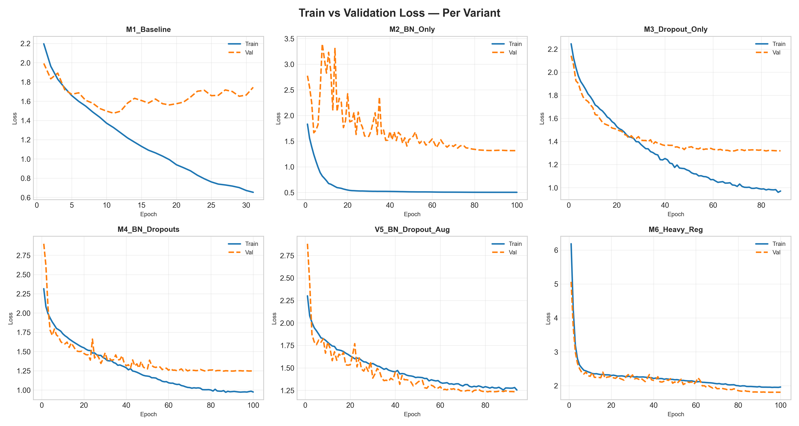

<div align="center">
```
██████╗ ███████╗ ██████╗ ██╗   ██╗██╗      █████╗ ██████╗ ██╗███████╗ █████╗ ████████╗██╗ ██████╗ ███╗   ██╗
██╔══██╗██╔════╝██╔════╝ ██║   ██║██║     ██╔══██╗██╔══██╗██║╚══███╔╝██╔══██╗╚══██╔══╝██║██╔═══██╗████╗  ██║
██████╔╝█████╗  ██║  ███╗██║   ██║██║     ███████║██████╔╝██║  ███╔╝ ███████║   ██║   ██║██║   ██║██╔██╗ ██║
██╔══██╗██╔══╝  ██║   ██║██║   ██║██║     ██╔══██║██╔══██╗██║ ███╔╝  ██╔══██║   ██║   ██║██║   ██║██║╚██╗██║
██║  ██║███████╗╚██████╔╝╚██████╔╝███████╗██║  ██║██║  ██║██║███████╗██║  ██║   ██║   ██║╚██████╔╝██║ ╚████║
╚═╝  ╚═╝╚══════╝ ╚═════╝  ╚═════╝ ╚══════╝╚═╝  ╚═╝╚═╝  ╚═╝╚═╝╚══════╝╚═╝  ╚═╝   ╚═╝   ╚═╝ ╚═════╝ ╚═╝  ╚═══╝
                                                                         U N D E R   P R E S S U R E
```
 
### `[ CIFAR-10 · LOW-DATA REGIME · CNN ABLATION STUDY ]`
 
<br>


 
<br>
```
╔══════════════════════════════════════════════════════════════════════╗
║  "More regularization doesn't always help.                          ║
║   Sometimes it actively destroys the model."                        ║
╚══════════════════════════════════════════════════════════════════════╝
```
 
<br>
| `PROTOCOL` | `ARCHITECTURE` | `OPTIMIZER` | `SEED` |
|:---:|:---:|:---:|:---:|
| Controlled Ablation | 4-Block CNN | Adam + CosineDecay | 42 |
 
</div>
---
 
## ◈ SYSTEM INIT — The Question
 
Can BatchNorm, Dropout, Data Augmentation, and L2 Regularization — individually and combined — actually **improve generalization** when you're severely data-constrained?
 
We trained **6 controlled CNN variants** on just 5,000 CIFAR-10 images (10% of the full dataset) to find out. Each variant isolates one or more regularization choices while holding the base architecture constant. The results are surprising.
 
---

## ⚙️ Experimental Protocol

### Data Splits

No leakage. No exceptions.

```
CIFAR-10 Train Split (50,000)          CIFAR-10 Test Split (10,000)
│                                       │
├─── 5,000  →  Train                   └─── 1,000  →  Test
└─── 1,000  →  Validation
```

Fixed seed `42`. All splits are disjoint by construction.

### Base Architecture

The **backbone never changes** across variants — only what's toggled inside `[brackets]`.

```
32×32×3 Input
    ↓
Conv2D(32)  → [BatchNorm] → ReLU → [SpatialDropout] → MaxPool
Conv2D(64)  → [BatchNorm] → ReLU → [SpatialDropout] → MaxPool
Conv2D(128) → [BatchNorm] → ReLU → [SpatialDropout] → MaxPool
Conv2D(256) → [BatchNorm] → ReLU → [SpatialDropout] → GlobalAvgPool
Dense(64)   → [BatchNorm] → ReLU → [Dropout]
Dense(10)   → Softmax
```

### Training Hyperparameters

| Hyperparameter | Value |
|:---|:---|
| Optimizer | Adam + Cosine Decay (lr = 0.001) |
| Batch Size | 32 |
| Label Smoothing | 0.1 |
| Early Stopping | patience = 20 on `val_loss` |
| Max Epochs | 100 |
| Gradient Clipping | `clipnorm = 1.0` |
| Loss | Categorical Cross-Entropy |

---

## 🧬 The Six Variants

| ID | Name | BN | SpatDrop | Dropout | Augment | L2 | Drop Rate | λ |
|:---:|:---|:---:|:---:|:---:|:---:|:---:|:---:|:---:|
| M1 | Baseline | ✗ | ✗ | ✗ | ✗ | ✗ | — | — |
| M2 | BN Only | ✓ | ✗ | ✗ | ✗ | ✗ | — | — |
| M3 | Dropout Only | ✗ | ✓ | ✓ | ✗ | ✗ | 0.3 | — |
| M4 | BN + Dropouts | ✓ | ✓ | ✓ | ✗ | ✗ | 0.3 | — |
| V5 | BN + Drop + Aug | ✓ | ✓ | ✓ | ✓ | ✗ | 0.3 | — |
| M6 | Everything | ✓ | ✓ | ✓ | ✓ | ✓ | 0.5 | 1e-3 |

---

## 📊 Results

### At a Glance

```
Test Accuracy (%)

M4  ████████████████████████████████████  70.5%  ← Best
V5  ████████████████████████████████▌     68.7%
M2  ████████████████████████████████      66.9%
M3  ██████████████████████████████▊       64.3%
M6  █████████████████████████▉            54.6%
M1  █████████████████████████▊            54.2%  ← Collapsed (overfit)
```

### Full Results Table

| Variant | Test Acc ↑ | Best Val | Train Acc | Overfit Gap | Epochs | Verdict |
|:---|:---:|:---:|:---:|:---:|:---:|:---|
| `M1_Baseline` | 54.2% | 56.3% | 98.2% | 🔴 +41.9% | 31 | Severe overfit, early stop |
| `M2_BN_Only` | 66.9% | 65.9% | 100.0% | 🔴 +34.1% | 100 | Memorized perfectly, generalized poorly |
| `M3_Dropout_Only` | 64.3% | 64.1% | 81.3% | 🟡 +17.0% | 88 | Stable but limited |
| **`M4_BN_Dropouts`** | **70.5%** | **69.9%** | **82.0%** | **🟢 +12.3%** | **100** | **Best — sweet spot** |
| `V5_BN_Drop_Aug` | 68.7% | 66.6% | 67.8% | ⚪ −0.4% | 94 | Augmentation hurt, not helped |
| `M6_Heavy_Reg` | 54.6% | 57.9% | 46.6% | 🔵 −11.3% | 100 | Can't even fit training data |

> **Overfit Gap** = `Train Acc − Val Acc`  
> Positive → overfitting &nbsp;|&nbsp; Near zero → balanced &nbsp;|&nbsp; Negative → capacity collapse

### The Spectrum

```
UNDER-REGULARIZED ←————————————————————————→ OVER-REGULARIZED

   M1          M2          M3          M4          V5          M6
 (No reg)   (BN only)  (Drop only) (BN+Drop)  (+Augment)  (+L2,0.5d)
  54.2%      66.9%       64.3%      70.5%       68.7%       54.6%
 gap+41.9   gap+34.1    gap+17.0   gap+12.3   gap-0.4     gap-11.3
                                      ↑
                                  SWEET SPOT
```

### Validation Accuracy Over Training

How each variant's validation accuracy evolves epoch-by-epoch. M4 (purple) climbs highest and most stably; M6 (teal) barely learns; M1 (red) plateaus early after overfitting.



---

## 💡 What We Learned

### 1 · BatchNorm accelerates overfitting when used alone

BN on 5K samples means computing statistics from batches that cover only **0.64% of the data**. Running estimates are noisy and biased. BN speeds up convergence — but with no explicit regularization, faster convergence just means **faster memorization**.

`M2` hit **100% training accuracy** by epoch 90. Validation never crossed 65.6%.

---

### 2 · SpatialDropout + BatchNorm is the best combination

These two techniques complement each other:

- **SpatialDropout** drops *entire feature maps*, not individual units. It prevents the network from relying on any single spatial feature — breaking feature co-adaptation at the channel level.
- **BatchNorm** then re-stabilizes the surviving activations, preventing gradient collapse or dead ReLUs caused by the aggressive dropout.

`M4` — the only variant with both — achieves **70.5% test accuracy** with just a **12.3% overfit gap**. No other variant comes close to both metrics simultaneously.

---

### 3 · Data augmentation *hurt* performance on 32×32 images

`V5` added `RandomRotation(0.05)`, `RandomZoom(0.05)`, and `RandomContrast(0.1)` on top of M4. It scored **68.7%** — *1.8% lower* than M4 with no augmentation.

Why? CIFAR-10 images are tiny. Discriminative features (an ear, a wheel, a wing) occupy **10–20 pixels**. A 5% zoom crops 2 pixels off each edge. An 18° rotation smears fine details into neighbouring pixels. The model ends up training on distorted artefacts that simply don't exist in the test set.

Augmentation creates invariance only when there's enough resolution to survive the transform.

---

### 4 · Stack too many constraints and the network can't learn anything

`M6` applies dropout (0.5) + L2 (1e-3) + BN + augmentation simultaneously. Training accuracy: **46.6%**. The model is below chance on several classes. It can't even fit the training data.

Each constraint reduces capacity. When constraints compound, you don't get a more robust model — you get a model with **no remaining degrees of freedom** to learn from.

### Generalisation Gap Over Training

Tracks how the Train − Val accuracy gap evolves per epoch. M1 and M2 blow up above 0.4. M4 stabilises near 0.12. V5 and M6 dip below zero — the hallmark of capacity collapse, not generalisation.



---

## 🖼️ Augmentation on Low-Resolution Data

| Transform | Effect on 32×32 CIFAR | Use? |
|:---|:---|:---:|
| `RandomFlip('horizontal')` | Mirrors object naturally, structure preserved | ✅ Safe |
| `RandomRotation(0.05)` | ±18° smears 10–20px features into noise | ❌ Avoid |
| `RandomZoom(0.05)` | Crops to 30×30, loses boundary context | ❌ Avoid |
| `RandomContrast(0.1)` | Shifts colour distributions that BN already handles | ❌ Avoid |
| Cutout / RandomErasing | Masks critical signal on already-small objects | ❌ Avoid |
| Mixup / CutMix | Highly effective at full scale; harmful under 10K | ❌ Avoid |

**Recommended augmentation for `< 64×64`, `< 10K` samples:**

```python
augmentation = keras.Sequential([
    keras.layers.RandomFlip("horizontal")   # the only safe choice
])
```

---

## 📐 Engineering Rules

Derived directly from experimental evidence — not intuition.

```
R1  →  SpatialDropout2D (0.2–0.3) + BatchNorm together, not separately
R2  →  No geometric augmentation on images < 64×64 pixels
R3  →  BatchNorm goes between Conv and ReLU (pre-activation placement)
R4  →  SpatialDropout2D in conv blocks, standard Dropout in dense blocks only
R5  →  Total regularization budget < 0.6 (normalized); M6 hit 1.0 and collapsed
R6  →  Early stopping on val_loss, not val_accuracy (loss detects overconfidence earlier)
R7  →  BatchNorm alone is not a regularizer — pair it with Dropout or L2 on small data
```

### Train vs Validation Loss — Per Variant

Six-panel loss grid. M1 shows classic train-loss descent with flat val-loss — hallmark overfitting. M4 shows both curves tracking together until smooth convergence. M6 shows both curves stuck high, confirming the model is not learning.



---

## 📁 Repository Structure

```
cifar10-lowdata-ablation/
│
├── results/
│   ├── Config.py            # All hyperparameters in one place
│   ├── data.py              # Strict CIFAR-10 split loading (no leakage)
│   ├── models.py            # 6 model variants, modular regularization toggles
│   ├── experiments.py       # Training orchestration + 5 standard plots
│   
│
├── results/
│   ├── results.json     # All numerical metrics
│   ├── figures/         # Auto-generated plots
│   └── *.weights.h5     # Saved checkpoints per variant
│
└── research_paper.md    # Full theoretical analysis
```

---

## 🚀 Quickstart

```bash
git clone <repo-url>
cd cifar10-lowdata-ablation
pip install -r requirements.txt

# Train all 6 variants (~30–60 min on CPU)
python experiments.py

# Generate publication figures
python plots.py
```

Outputs:
- `results/results.json` — metrics for all variants
- `results/figures/` — all plots
- `results/*.weights.h5` — per-variant checkpoints

**Environment:** Python 3.10+ · TensorFlow 2.15 · Windows 11 / WSL2 / Ubuntu 22.04

---

## 📄 Citation

```bibtex
@misc{cifar10_lowdata_ablation_2026,
  title        = {Regularization Under Pressure: Architectural Ablation
                  in Low-Data Regime Image Classifiers},
  author       = {Aman},
  year         = {2026},
  note         = {Ablation study on CIFAR-10 with 5,000 training samples},
  howpublished = {\url{https://github.com/<your-repo>}}
}
```

---

<div align="center">

MIT License &nbsp;·&nbsp; Reproducible with seed `42` &nbsp;·&nbsp; IIIT Dharwad

</div>
---

## 🔍 The Question

Can BatchNorm, Dropout, Data Augmentation, and L2 Regularization — individually and combined — actually **improve generalization** when you're severely data-constrained?

We trained **6 controlled CNN variants** on just 5,000 CIFAR-10 images (10% of the full dataset) to find out. Each variant isolates one or more regularization choices while holding the base architecture constant. The results are surprising.

---

## ⚙️ Experimental Protocol

### Data Splits

No leakage. No exceptions.

```
CIFAR-10 Train Split (50,000)          CIFAR-10 Test Split (10,000)
│                                       │
├─── 5,000  →  Train                   └─── 1,000  →  Test
└─── 1,000  →  Validation
```

Fixed seed `42`. All splits are disjoint by construction.

### Base Architecture

The **backbone never changes** across variants — only what's toggled inside `[brackets]`.

```
32×32×3 Input
    ↓
Conv2D(32)  → [BatchNorm] → ReLU → [SpatialDropout] → MaxPool
Conv2D(64)  → [BatchNorm] → ReLU → [SpatialDropout] → MaxPool
Conv2D(128) → [BatchNorm] → ReLU → [SpatialDropout] → MaxPool
Conv2D(256) → [BatchNorm] → ReLU → [SpatialDropout] → GlobalAvgPool
Dense(64)   → [BatchNorm] → ReLU → [Dropout]
Dense(10)   → Softmax
```

### Training Hyperparameters

| Hyperparameter | Value |
|:---|:---|
| Optimizer | Adam + Cosine Decay (lr = 0.001) |
| Batch Size | 32 |
| Label Smoothing | 0.1 |
| Early Stopping | patience = 20 on `val_loss` |
| Max Epochs | 100 |
| Gradient Clipping | `clipnorm = 1.0` |
| Loss | Categorical Cross-Entropy |

---

## 🧬 The Six Variants

| ID | Name | BN | SpatDrop | Dropout | Augment | L2 | Drop Rate | λ |
|:---:|:---|:---:|:---:|:---:|:---:|:---:|:---:|:---:|
| M1 | Baseline | ✗ | ✗ | ✗ | ✗ | ✗ | — | — |
| M2 | BN Only | ✓ | ✗ | ✗ | ✗ | ✗ | — | — |
| M3 | Dropout Only | ✗ | ✓ | ✓ | ✗ | ✗ | 0.3 | — |
| M4 | BN + Dropouts | ✓ | ✓ | ✓ | ✗ | ✗ | 0.3 | — |
| V5 | BN + Drop + Aug | ✓ | ✓ | ✓ | ✓ | ✗ | 0.3 | — |
| M6 | Everything | ✓ | ✓ | ✓ | ✓ | ✓ | 0.5 | 1e-3 |

---

## 📊 Results

### At a Glance

```
Test Accuracy (%)

M4  ████████████████████████████████████  70.5%  ← Best
V5  ████████████████████████████████▌     68.7%
M2  ████████████████████████████████      66.9%
M3  ██████████████████████████████▊       64.3%
M1  █████████████████████████▊            54.2%
M6  █████████████████████████▉            54.6%  ← Collapsed
```

### Full Results Table

| Variant | Test Acc ↑ | Best Val | Train Acc | Overfit Gap | Epochs | Verdict |
|:---|:---:|:---:|:---:|:---:|:---:|:---|
| `M1_Baseline` | 54.2% | 56.3% | 98.2% | 🔴 +41.9% | 31 | Severe overfit, early stop |
| `M2_BN_Only` | 66.9% | 65.9% | 100.0% | 🔴 +34.1% | 100 | Memorized perfectly, generalized poorly |
| `M3_Dropout_Only` | 64.3% | 64.1% | 81.3% | 🟡 +17.0% | 88 | Stable but limited |
| **`M4_BN_Dropouts`** | **70.5%** | **69.9%** | **82.0%** | **🟢 +12.3%** | **100** | **Best — sweet spot** |
| `V5_BN_Drop_Aug` | 68.7% | 66.6% | 67.8% | ⚪ −0.4% | 94 | Augmentation hurt, not helped |
| `M6_Heavy_Reg` | 54.6% | 57.9% | 46.6% | 🔵 −11.3% | 100 | Can't even fit training data |

> **Overfit Gap** = `Train Acc − Val Acc`  
> Positive → overfitting &nbsp;|&nbsp; Near zero → balanced &nbsp;|&nbsp; Negative → capacity collapse

### The Spectrum

```
UNDER-REGULARIZED ←————————————————————————→ OVER-REGULARIZED

   M1          M2          M3          M4          V5          M6
 (No reg)   (BN only)  (Drop only) (BN+Drop)  (+Augment)  (+L2,0.5d)
  54.2%      66.9%       64.3%      70.5%       68.7%       54.6%
 gap+41.9   gap+34.1    gap+17.0   gap+12.3   gap-0.4     gap-11.3
                                      ↑
                                  SWEET SPOT
```

---

## 💡 What We Learned

### 1 · BatchNorm accelerates overfitting when used alone

BN on 5K samples means computing statistics from batches that cover only **0.64% of the data**. Running estimates are noisy and biased. BN speeds up convergence — but with no explicit regularization, faster convergence just means **faster memorization**.

`M2` hit **100% training accuracy** by epoch 90. Validation never crossed 65.6%.

---

### 2 · SpatialDropout + BatchNorm is the best combination

These two techniques complement each other:

- **SpatialDropout** drops *entire feature maps*, not individual units. It prevents the network from relying on any single spatial feature — breaking feature co-adaptation at the channel level.
- **BatchNorm** then re-stabilizes the surviving activations, preventing gradient collapse or dead ReLUs caused by the aggressive dropout.

`M4` — the only variant with both — achieves **70.5% test accuracy** with just a **12.3% overfit gap**. No other variant comes close to both metrics simultaneously.

---

### 3 · Data augmentation *hurt* performance on 32×32 images

`V5` added `RandomRotation(0.05)`, `RandomZoom(0.05)`, and `RandomContrast(0.1)` on top of M4. It scored **68.7%** — *1.8% lower* than M4 with no augmentation.

Why? CIFAR-10 images are tiny. Discriminative features (an ear, a wheel, a wing) occupy **10–20 pixels**. A 5% zoom crops 2 pixels off each edge. An 18° rotation smears fine details into neighboring pixels. The model ends up training on distorted artifacts that simply don't exist in the test set.

Augmentation creates invariance only when there's enough resolution to survive the transform.

---

### 4 · Stack too many constraints and the network can't learn anything

`M6` applies dropout (0.5) + L2 (1e-3) + BN + augmentation simultaneously. Training accuracy: **46.6%**. The model is below chance on several classes. It can't even fit the training data.

Each constraint reduces capacity. When constraints compound, you don't get a more robust model — you get a model that has **no remaining degrees of freedom** to learn from.

---

## 🖼️ Augmentation on Low-Resolution Data

| Transform | Effect on 32×32 CIFAR | Use? |
|:---|:---|:---:|
| `RandomFlip('horizontal')` | Mirrors object naturally, structure preserved | ✅ Safe |
| `RandomRotation(0.05)` | ±18° smears 10–20px features into noise | ❌ Avoid |
| `RandomZoom(0.05)` | Crops to 30×30, loses boundary context | ❌ Avoid |
| `RandomContrast(0.1)` | Shifts color distributions that BN already handles | ❌ Avoid |
| Cutout / RandomErasing | Masks critical signal on already-small objects | ❌ Avoid |
| Mixup / CutMix | Highly effective at full scale; harmful under 10K | ❌ Avoid |

**Recommended augmentation for `< 64×64`, `< 10K` samples:**

```python
augmentation = keras.Sequential([
    keras.layers.RandomFlip("horizontal")   # the only safe choice
])
```

---

## 📐 Engineering Rules

Derived directly from experimental evidence — not intuition.

```
R1  →  SpatialDropout2D (0.2–0.3) + BatchNorm together, not separately
R2  →  No geometric augmentation on images < 64×64 pixels
R3  →  BatchNorm goes between Conv and ReLU (pre-activation placement)
R4  →  SpatialDropout2D in conv blocks, standard Dropout in dense blocks only
R5  →  Total regularization budget < 0.6 (normalized); M6 hit 1.0 and collapsed
R6  →  Early stopping on val_loss, not val_accuracy (loss detects overconfidence earlier)
R7  →  BatchNorm alone is not a regularizer — pair it with Dropout or L2 on small data
```

---

## 📁 Repository Structure

```
cifar10-lowdata-ablation/
│
├── Config.py            # All hyperparameters in one place
├── data.py              # Strict CIFAR-10 split loading (no leakage)
├── models.py            # 6 model variants, modular regularization toggles
├── experiments.py       # Training orchestration + 5 standard plots
├── plots.py             # 4 additional publication-quality figures
│
├── results/
│   ├── results.json     # All numerical metrics
│   ├── figures/         # Auto-generated plots
│   └── *.weights.h5     # Saved checkpoints per variant
│
└── research_paper.md    # Full theoretical analysis
```

## 📄 Citation

```bibtex
@misc{cifar10_lowdata_ablation_2026,
  title        = {Regularization Under Pressure: Architectural Ablation
                  in Low-Data Regime Image Classifiers},
  author       = {Aman},
  year         = {2026},
  note         = {Ablation study on CIFAR-10 with 5,000 training samples},
  howpublished = {\url{https://github.com/<your-repo>}}
}
```

---

<div align="center">

MIT License &nbsp;·&nbsp; Reproducible with seed `42` &nbsp;·&nbsp; IIIT Dharwad

</div>
